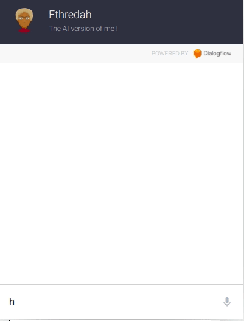
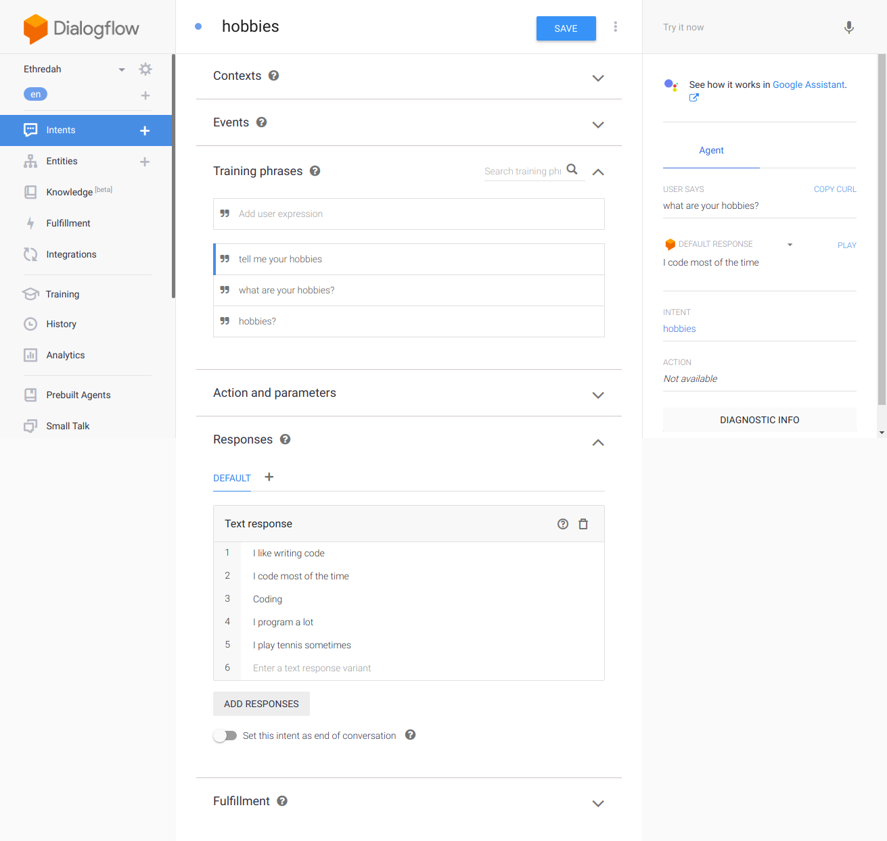
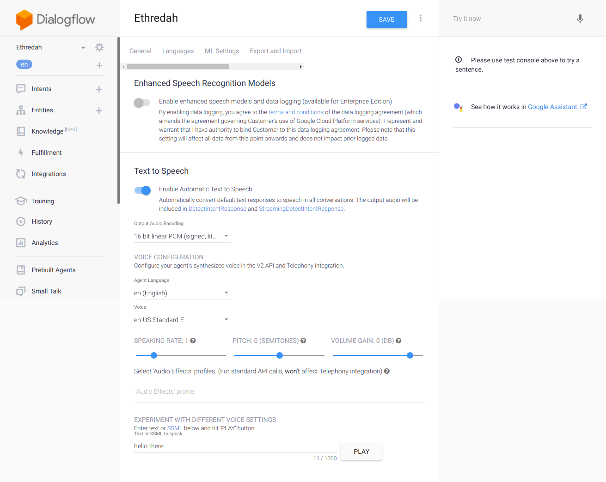

## WELL..

### This is an AI Version of me!
	
I know it's wierd making a bot version of you but this is to also demonstrates making a simple chat bot with dialogflow.

 

### QUICK START
To use this chatbot, download the zipped file of the repository and import it in a new agent on your DialogFlow Console.

## Okay then...let's get started:

* Go to DialogFlow Console
 Create a new Agent 

 * Create An Intent

  Create an Intent _This one is about hobbies_  where you ask the bot what her hobbies are :)

   

  * Enable Speech

   To enable the bot talk back to users enable speech under settings and choose the desired output encoding.

   

   *Create More Intents of your choice and train the agent with enough data to answer queries efficiently*

   

   
There's so much more than a simple chatbot you can make with Dialogflow.

   
It is a great place to get started with AI and ML

